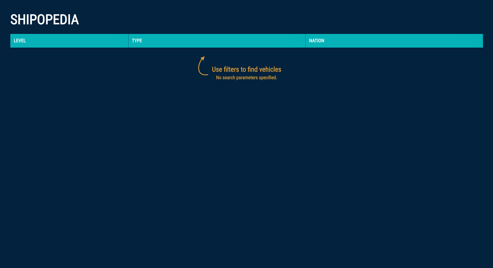
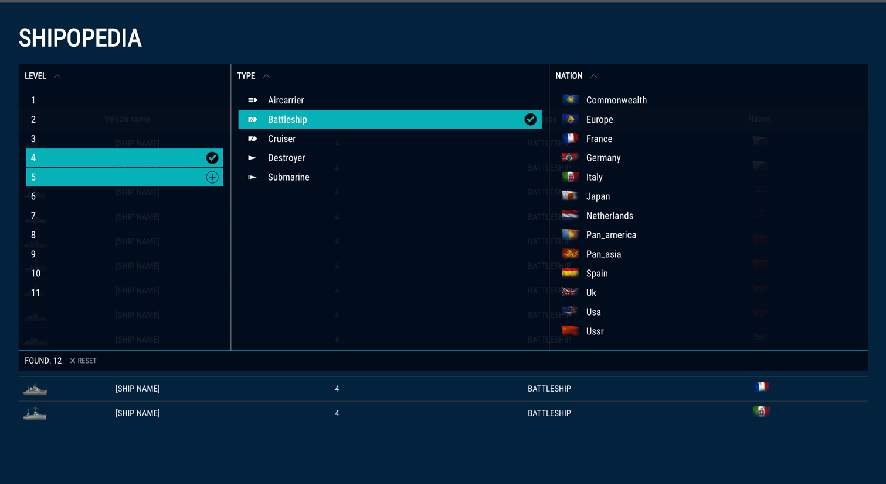
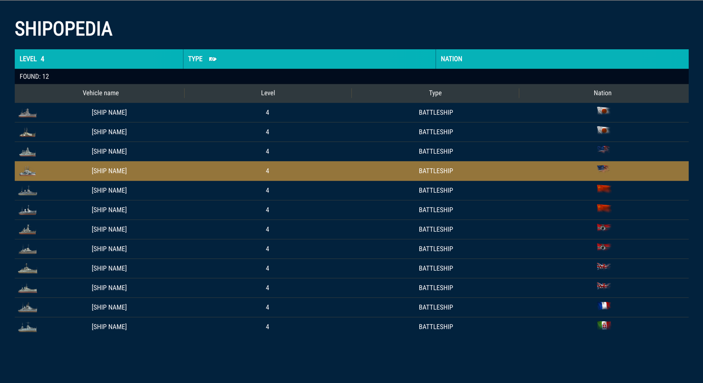
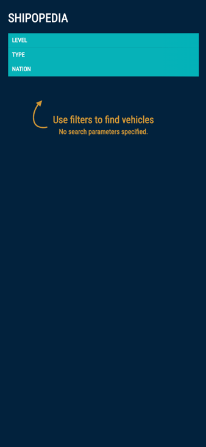
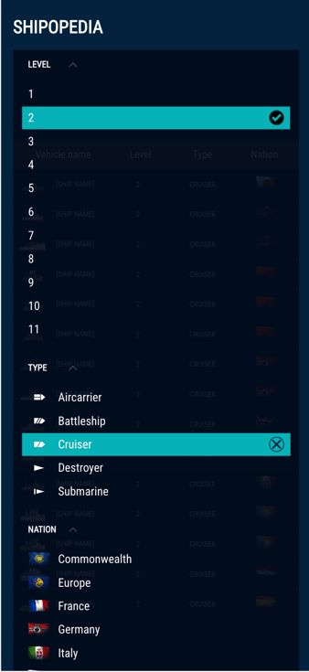
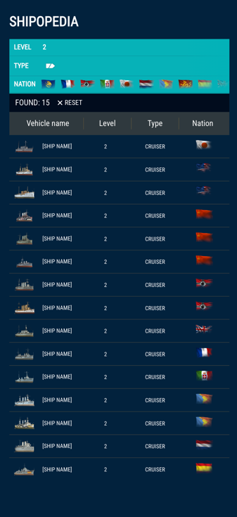
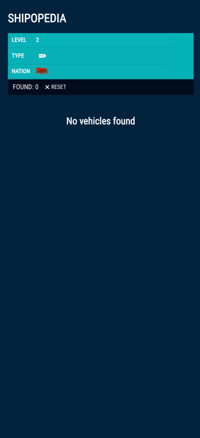

# Demo screens:
## Desktop

## Mobile

## Technologies Used
- TypeScript
- Vue 3 Composition API
- Pinia
- Vite
- Scss

## How to Run
1. Clone this repository.
2. Navigate to the project directory.
3. Install dependencies using `npm install`.
4. Run the development server using `npm run dev`.
5. Open your browser and go to `http://localhost:8080` 
